# 🏋️ GymTracker Pro

Aplicación móvil desarrollada en Android Studio utilizando Jetpack Compose y Room Database para la gestión y seguimiento de rutinas de entrenamiento fitness.

## 📱 Descripción del proyecto

GymTracker Pro es una aplicación enfocada en ayudar a los usuarios a gestionar sus entrenamientos de gimnasio de manera organizada y moderna.

La aplicación permite:

- Registro e inicio de sesión de usuarios
- Gestión de rutinas fitness
- Crear, editar y eliminar entrenamientos
- Visualizar estadísticas personales
- Navegación moderna con Drawer
- Persistencia de datos offline usando Room
- Interfaz moderna rediseñada con ayuda de IA (Gemini)

---

# 🚀 Tecnologías utilizadas

- Kotlin
- Android Studio
- Jetpack Compose
- Material 3
- Room Database (SQLite)
- Navigation Compose
- Gemini AI
- Gradle

---

# 🤖 Uso de Inteligencia Artificial

Para este proyecto se utilizó Gemini AI como apoyo para:

- Modernización de interfaces UI/UX
- Diseño visual fitness premium
- Mejora de experiencia de usuario
- Optimización visual de pantallas
- Generación de componentes modernos en Jetpack Compose

---

# 📸 Comparativa: Antes vs Después

---

# 🔐 Login Screen

| Antes | Después |
|--------|----------|
| 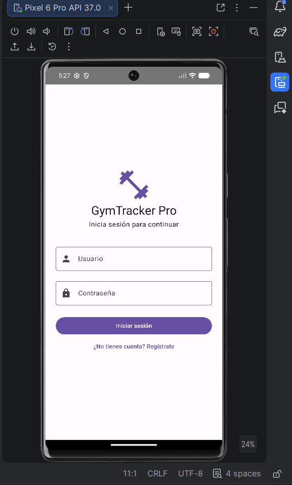 | 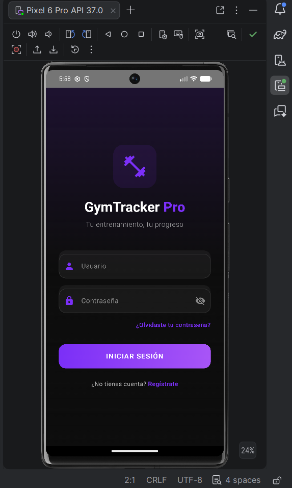 |

---

# 📝 Registro Screen

| Antes | Después |
|--------|----------|
| 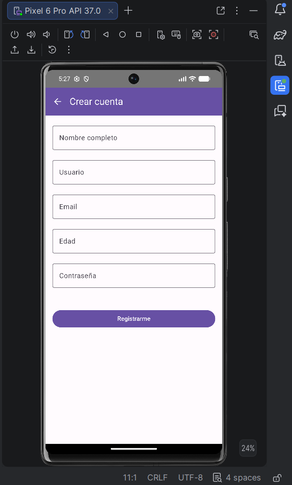 | 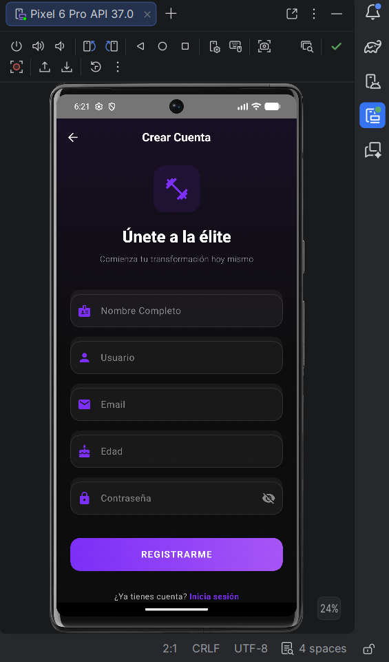 |

---

# 🏠 Menú Principal

| Antes | Después |
|--------|----------|
| 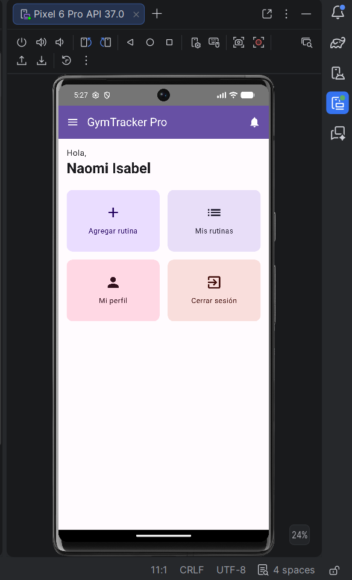 | 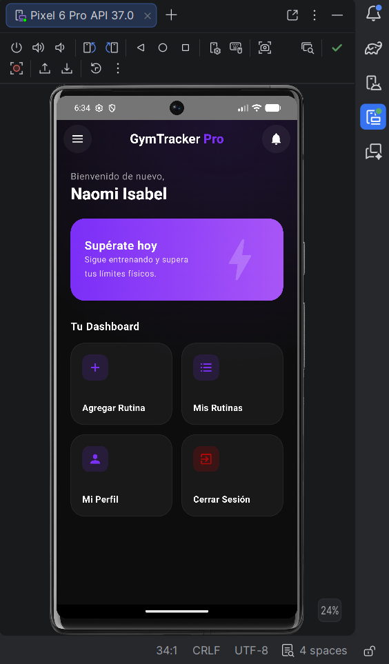 |

---

# 📋 Lista de Rutinas

| Antes | Después |
|--------|----------|
| 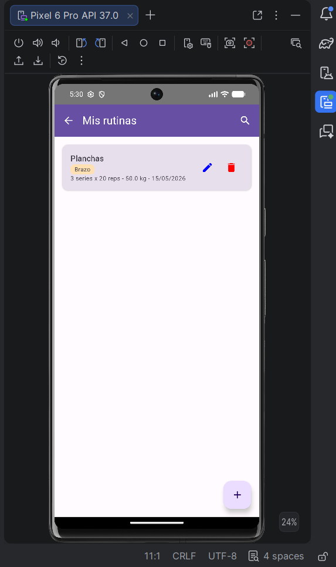 | 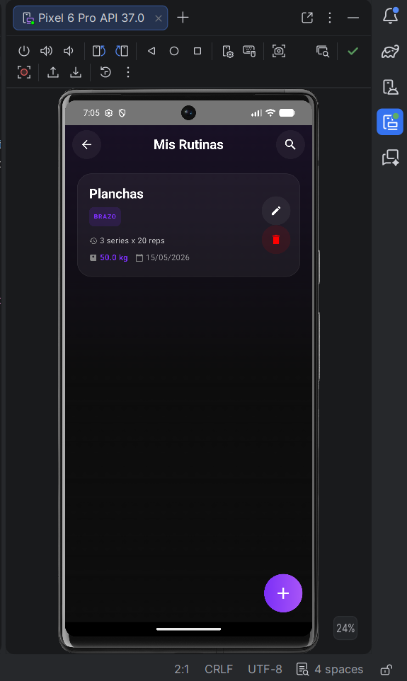 |

---

# ➕ Nueva Rutina

| Antes | Después |
|--------|----------|
| 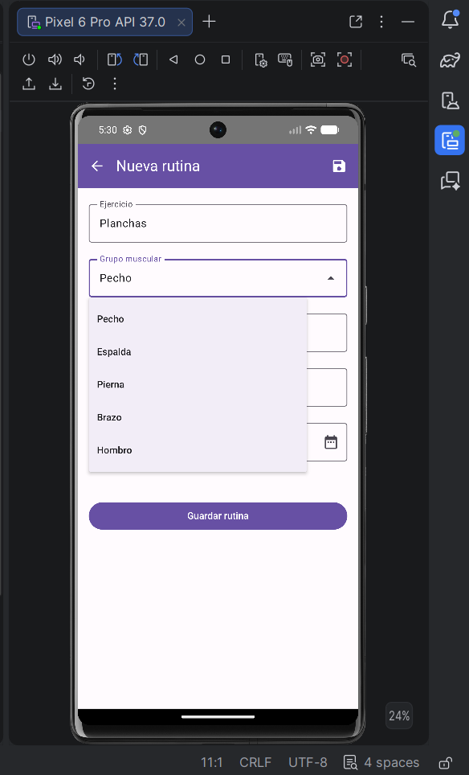 | 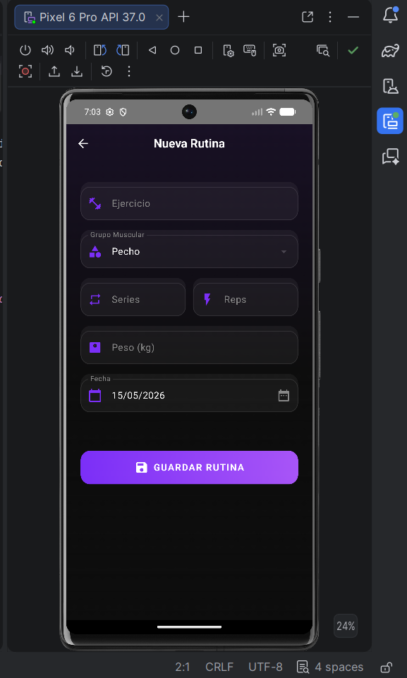 |

---

# ✏️ Detalle de Rutina

| Antes | Después |
|--------|----------|
|  | 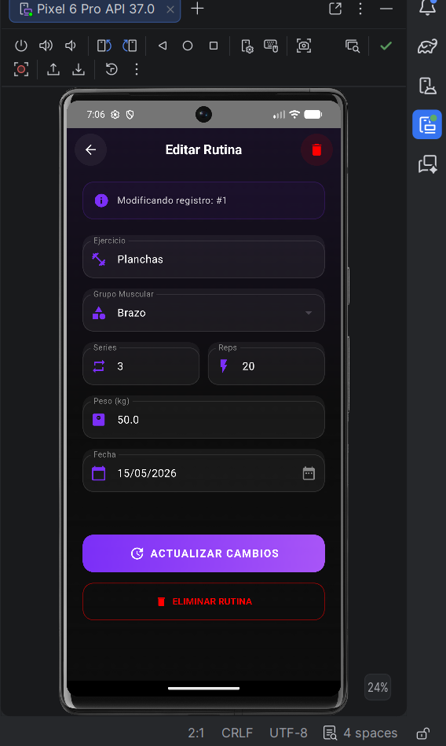 |

---

# 👤 Perfil de Usuario

| Antes | Después |
|--------|----------|
| 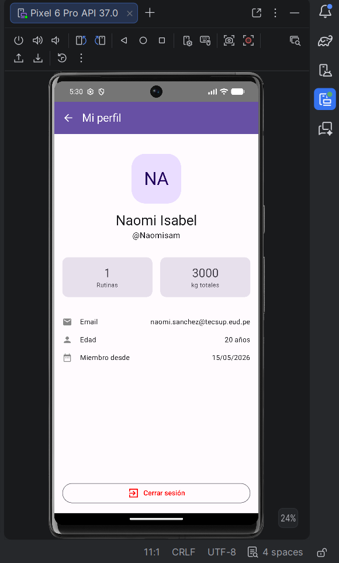 | 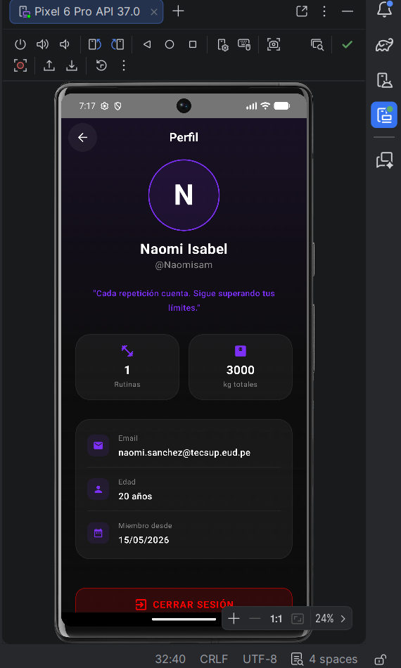 |

---

# 📂 Estructura principal del proyecto

```bash
app/
 ├── data/
 ├── database/
 ├── navigation/
 ├── screens/
 ├── ui/
 └── viewmodel/
```

---

# 🎯 Mejoras implementadas

✅ Diseño moderno estilo fitness premium  
✅ Tema oscuro profesional  
✅ Glassmorphism y gradientes modernos  
✅ Cards y botones modernos  
✅ Animaciones suaves  
✅ Mejor experiencia visual  
✅ Interfaces responsive  
✅ Navegación mejorada  
✅ Integración de IA para modernización UI  

---

# 👩‍💻 Autoras

Proyecto desarrollado como práctica académica para Programación en Móviles.

- Sheila Diaz Rojas
- Naomi Sanchez Chavarria

---

# ⭐ Resultado Final

GymTracker Pro evolucionó desde una aplicación básica CRUD hacia una experiencia visual moderna y profesional inspirada en aplicaciones fitness premium utilizando Jetpack Compose + Gemini AI.